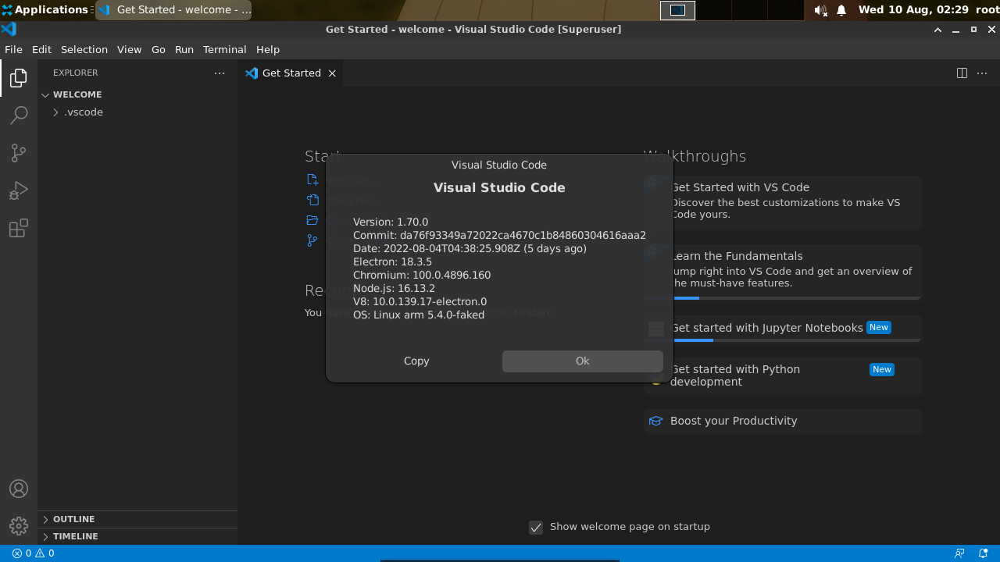
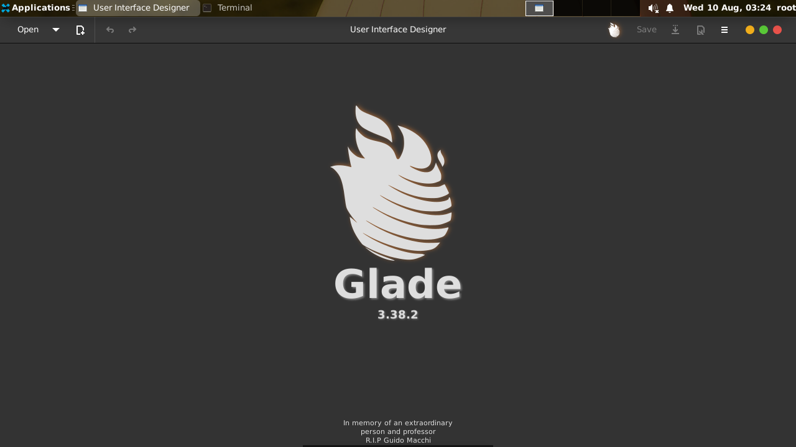

# debdroid

A Custom Debian Rootless Mount Filesystem Repository

## Badges
OS : 

For: 


## Features & Instruction 

Installing debdroid is quite easy, copy this one line code

```
chmod +x *.sh ; ./bootstrap.sh
```

After that, clone this work : `https://github.com/SUFandom/debdroid-starter`

But if theres bugs, head to [issues](http://github.com/SUFandom/debdroid/issues) page

## Screenshot



*VSCode Running Perfectly on 1.70*


*Home Screen*



*Glade Running*

## Known Issues

* ~~There may be Chance that this Script cant extract the Distro so you need to report it immediately.~~
* Sometimes, `tracker-miner-fs` tend to get installed automatically for no reason via apt, not to worry as its not a Bitcoin Mining malware but a GNOME file mapper to 'find files faster' but just hogging system CPU up to 100 and eating all ram and swap, im advising you to delete the package immediately.
* Chromium doesn't work on Root, make an account instead and dont forget to add `--no-sandbox --enable-crashpad` to work
* All electron apps should be executed with `--no-sandbox --enable-crashpad` to work
* ~~This version dont have a recompiled Mesa, that will be in the future~~
* Dont launch apps on Application toolbar, use on Desktop when using VSCode only
* For more help, go on issues page
