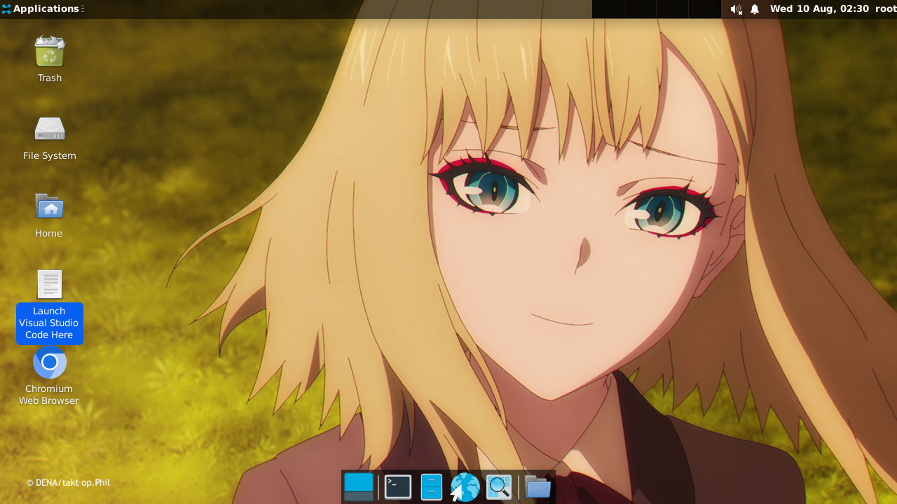

# debdroid

A Custom Debian Rootless Mount Filesystem Repository

## Badges
OS : 

For: 


## Question

- My Device is just 64 bit ARM `(armv8a/Aarch64)`, is this distro still supported?

Yes. This Distro is using armhf `(armv7a)` type and the 32 bit component is still exists in modern 64 bit cpu, maybe in 2028 (just guessing) it will be the end of life of 32 bit as its y2k32 (correct me on this) will cause 32 bit integers to not function properly.

- Is this distro still just a Debian but just modified?

Yes sort-of (it needs debdroid-starter to be called 'modified Debian'), to make sure like VSCode and other packages can work

- Can i add 64 bit ARM packages in this distro?

Yes, but you have to input `dpkg add-architecture arm64` to continue and install 64 bit apps, **REMINDER THAT THIS WILL ONLY WORK IF YOU REALLY HAVE 64 BIT CPU!!!**

## Features & Instruction 

Installing debdroid is quite easy, copy this one line code

```
chmod +x *.sh ; ./bootstrap.sh
```

After that, clone this [work](https://github.com/SUFandom/debdroid-starter). Although it will be prob. Pre-installed on Net. Heh..

But if theres bugs, head to [issues](http://github.com/SUFandom/debdroid/issues) page

## Screenshot


*VSCode Running Perfectly on 1.70*



*Home Screen*


*Glade Running*

## Known Issues

* ~~There may be Chance that this Script cant extract the Distro so you need to report it immediately.~~
* Sometimes, `tracker-miner-fs` tend to get installed automatically for no reason via apt, not to worry as its not a Bitcoin Mining malware but a GNOME file mapper to 'find files faster' but just hogging system CPU up to 100 and eating all ram and swap, im advising you to delete the package immediately.
* Chromium doesn't work on Root, make an account instead and dont forget to add `--no-sandbox --enable-crashpad` to work
* All electron apps should be executed with `--no-sandbox --enable-crashpad` to work
* ~~This version dont have a recompiled Mesa, that will be in the future~~
* Dont launch apps on Application toolbar, use on Desktop when using VSCode only
* For more help, go on issues page
